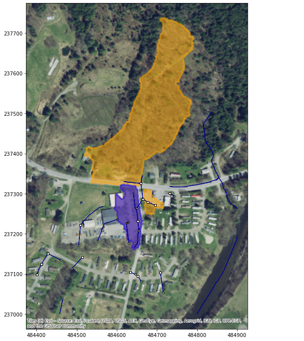

# stormcatchments
[](https://pypi.python.org/pypi/stormcatchments)
[](https://stormcatchments.readthedocs.io/en/latest/)

## Stormwater network aware catchment delineation

Converts existing stormwater infrastucture GIS feature data (points and lines) into a
```networkx``` directed graph (```DiGraph```) object, then utilizes the ```DiGraph``` to
incorporate subsurface flows into urban stormwater catchment delineation.

Dependencies of ```stormcatchments``` include:
- [```geopandas```](https://github.com/geopandas/geopandas)
- [```networkx```](https://github.com/networkx/networkx)
- [```pysheds```](https://github.com/mdbartos/pysheds)
- [```rtree```](https://github.com/Toblerity/rtree)

Similar libraries/projects:
- [```s2g```](https://github.com/caesar0301/s2g)
- [```networkx``` module ```nx_shp.py```](https://github.com/networkx/networkx/blob/6e20b952a957af820990f68d9237609198088816/networkx/readwrite/nx_shp.py)


## Installation

To install from PyPI:
```
pip install stormcatchments
```

## Input data requirements

To utilize this package, you need both **point** and **line** spatial data, which could represent a network of catchbasins and stormlines. The file format does not matter as long as it can be successfully read into a ```geopandas.GeoDataFrame```. The line data must connect to the points, and lines must have verticies snapped to the points.

This was initially developed for [Vermont Agency of Natural Resources stormwater infrastructure dataset](https://gis-vtanr.hub.arcgis.com/maps/VTANR::stormwater-infrastructure/explore?location=43.609172%2C-72.968811%2C14.15). However, the package is intended to generalize to any infrastructure dataset that meets these basic requirements.


## Example Usage

### Imports
```python
import geopandas as gpd
import stormcatchments as sc
```
### Read infrastructure data
```python
storm_lines = gpd.read_file('tests/test_data/johnson_vt/storm_lines.shp')
storm_lines.set_index('OBJECTID', inplace=True)
storm_pts = gpd.read_file('tests/test_data/johnson_vt/storm_pts.shp')
storm_pts.set_index('OBJECTID', inplace=True)
```
### Initialize Network object and resolve directions
```python
# storm_pts contains a column "Type" with integer values describing what type of 
# structure each point represents
sinks = [2, 8] # Corresponds to catchbasins and culvert inlets
sources = [5, 9] # Corresponds to outfalls and culvert outlets

net = sc.Network(
  storm_lines, storm_pts, type_column='Type', sink_types=sinks, source_types=sources
)
```
Refer to [Mapping flow sinks and sources](#mapping-flow-sinks-and-sources) below for more information on initializing a ```Network```
### Resolve flow directions of the Network
```python
net.resolve_directions(method='from_sources', verbose=True)
```
Output:
```
Adding edges...
Succesfully resolved direction for 202 edges
```
Refer to [Determining subsurface flow direction](#determining-subsurface-flow-direction) below for more information of resolving ```Network``` directions
### Preprocess terrain data
```python
grid, fdir, acc = sc.terrain.preprocess_dem('tests/test_data/johnson_vt/dem.tif')
```
Note that ```sc.terrain.preprocess_dem()``` uses default settings for ```pysheds```. It's worth experimenting with this step to try and improve results with your DEM.
### Initialize Delineate object and get a stormcatchment
```python
grid_epsg = 6589
delin = sc.Delineate(net, grid, fdir, acc, grid_epsg)

# (x, y) coordinates in same CRS as grid
pour_pt = (484636, 237170)
# get stormcatchment using the default accumulation threshold
stormcatchment = delin.get_stormcatchment(pour_pt, acc_thresh=1000)
```
### Also get the original catchment (network unaware) to compare results
```python
catchment = sc.delineate.get_catchment(
  pour_pt, grid, fdir, acc, grid_epsg, acc_thresh=1000
)
```
### Plot original catchment in blue and stormcatchment in orange
This uses the built-in ```net.draw()``` method, which adds a ```contextily``` basemap when ```add_basemap=True```. Note that the orange stormcatchment incorporates a large hillside 
that pipes to the pour point.
```python
import matplotlib.pyplot as plt

fig, ax = plt.subplots(figsize=(12, 12))
stormcatchment.plot(ax=ax, ec='orange', fc='orange', alpha=0.5, linewidth=3)
catchment.plot(ax=ax, ec='blue', fc='blue', alpha=0.5, linewidth=3)
net.draw(ax=ax, add_basemap=True)
```



## Mapping flow sinks and sources

Flow sinks are where flow can enter a subsurface system (such as a catchbasin). Flow sources are where flow can exit a subsurface system (such as an outfall). Initializing the ```network.Network``` requires either:
- Manually setting two ```bool``` columns in the point ```GeoDataFrame```, named ```IS_SINK``` and ```IS_SOURCE``` that are set to ```True``` if a point falls into either category.
- Defining a ```type_column``` in the point data, then supplying a ```list``` of ```sink_types``` and a ```list``` of ```source_types``` to lookup in the ```type_column```. This will then be mapped onto two ```bool``` columns in the point data named ```IS_SINK``` and ```IS_SOURCE```.


## Determining subsurface flow direction

Resolving the flow direction of subsurface stormwater networks, which is done during ```network.Network.resolve_directions()```, can be done in three ways:
1) ```from_sources```: This is the default. This method traces networks upstream from their discharge points. This assumes that subnetworks are comprised of one or more flow sinks that flow to a single flow source. If multiple flow sources are connected to a given flow sink, this method will run into issues since determining which flow source is the terminal node in the graph would need to incorporate pipe elevation data somehow.
2) ```vertex_order```: This defines the subsurface flow direction using the order of verticies in the line data (flowing from the first to last vertex).
3) ```vertex_order_r```: This is the same as above, but in reverse (flowing from last to first vertex).

Two other potential methods that are not yet implemented are:
- Using surface elevation data as an analog for for subsurface pipe elevations. In flat urban settings this would likely have a lot of issues/inaccuracies.
- Using pipe invert data from the attributes of point or line data. This would require manual preparation by the user but would be the most accurate method.

## Validating network topology

Several functions are available in ```stormcatchments.topology``` to assist in validating the topology of your input data. These include:
- ```find_floating_points```: Returns points that aren't snapped to a line vertex. Floating points cannot be incorporated into the Network.
- ```snap_points```: Returns an altered copy of a ```stormcatchments.Network``` in which any floating points are snapped to the nearest vertex, within a specified snapping tolerance.
- ```find_multi_outlet```: Returns a ```GeoDataFrame``` containing geometry for subgraphs within a ```Network``` that have multiple flow sources (outlets). Delineation results may not be optimal in mutli-outlet subgraphs depending on how the directions are resolved within them. Having a single outlet ensures predictable delineation results.
